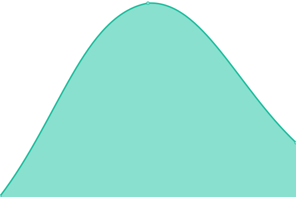

# [📈 Live Status](https://status.askkai.org): <!--live status--> **🟩 All systems operational**

This repository contains the open-source uptime monitor and status page for [K12 Analytics Engineering](https://status.askkai.org), powered by [Upptime](https://github.com/upptime/upptime).

With [Upptime](https://upptime.js.org), you can get your own unlimited and free uptime monitor and status page, powered entirely by a GitHub repository. We use [Issues](https://github.com/K12-Analytics-Engineering/kai-status/issues) as incident reports, [Actions](https://github.com/K12-Analytics-Engineering/kai-status/actions) as uptime monitors, and [Pages](https://status.askkai.org) for the status page.

<!--start: status pages-->
<!-- This summary is generated by Upptime (https://github.com/upptime/upptime) -->
<!-- Do not edit this manually, your changes will be overwritten -->
<!-- prettier-ignore -->
| URL | Status | History | Response Time | Uptime |
| --- | ------ | ------- | ------------- | ------ |
|  [Kai](https://askkai.org) | 🟩 Up | [kai.yml](https://github.com/K12-Analytics-Engineering/kai-status/commits/HEAD/history/kai.yml) | 

 228ms
     
 | 

<a href="https://status.askkai.org/history/kai">100.00%</a>
    

|  [Kai API](https://askkai.org/api/health) | 🟩 Up | [kai-api.yml](https://github.com/K12-Analytics-Engineering/kai-status/commits/HEAD/history/kai-api.yml) | 

 296ms
     
 | 

<a href="https://status.askkai.org/history/kai-api">100.00%</a>
    

|  [K12 Analytics Engineering](https://k12analyticsengineering.dev) | 🟩 Up | [k12-analytics-engineering.yml](https://github.com/K12-Analytics-Engineering/kai-status/commits/HEAD/history/k12-analytics-engineering.yml) | 

 128ms
     
 | 

<a href="https://status.askkai.org/history/k12-analytics-engineering">100.00%</a>
    

|  [Kai Status](https://status.askkai.org) | 🟩 Up | [kai-status.yml](https://github.com/K12-Analytics-Engineering/kai-status/commits/HEAD/history/kai-status.yml) | 

 274ms
     
 | 

<a href="https://status.askkai.org/history/kai-status">100.00%</a>
    

<!--end: status pages-->

[**Visit our status website →**](https://status.askkai.org)

## 📄 License

- Powered by: [Upptime](https://github.com/upptime/upptime)
- Code: [MIT](./LICENSE) © [Anand Chowdhary](https://anandchowdhary.com), supported by [Pabio](https://pabio.com)
- Data in the `./history` directory: [Open Database License](https://opendatacommons.org/licenses/odbl/1-0/)
